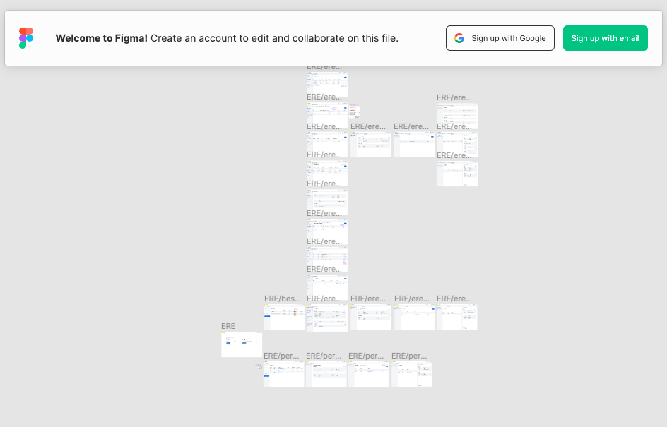

# Feedback geven op Figma mockups

## Figma navigeren

**Met een muis**: \
Om te **navigeren** tussen de verschillen schermen moet je **spatie en rechter muisknop** tegelijk ingedrukt houden en je muis bewegen. 

**Met een trackpad**: \
Als je een trackpad hebt, kan je heel makkelijk door de schermen in Figma navigeren, door met je vingers te slepen.

Om **in te zoomen** naar een scherm, kan je** + **of **- **op je toetsenbord gebruiken (dit kan verschillen per toetsenbord). Je kan ook rechts boven zoom opties vinden met verschillende toetsenbord sneltoetsen terug vinden. 

Als je een trackpad hebt, kan je ook makkelijk in- en uitzoomen door je twee vingers van of naar elkaar te slepen.

## Feedback geven

Feedback geven via Figma doe je door _**comments **_ te laten op schermen. 

#### Stap 1: Account aanmaken

Een designer bezorgt een Figma link naar mockups. Om comments te kunnen schrijven, moet je eerst een account aanmaken.

#### Stap 2: Comments schrijven

Eens je een Figma account hebt aangemaakt, kan je comments laten op specifieke plekken op de schermen.

Om in comment modus te gaan, moet je op het tekst ballonetje linke boven klikken. Je muis zal dan in een pin veranderen. Deze kan je eender waar in het document plaatsen. Wanneer je dit doet, maak je een comment aan. Dan mag je daar relevante feedback schrijven. 

Als je per ongeluk op de verkeerde plaats een pin zet, kan je op Cancel drukken, of ergens anders op de scherm klikken met je muis. Dit zorgt ervoor dat de pin verdwijnt.

Eens je je feedback geschreven hebt, mag je op "post" drukken. Dit maakt je comment zichtbaar voor iedereen die toegang heeft tot de Figma link. Je kan een lijst van alle comments zien op de rechter kant van je scherm, wanneer je in "comment modus" bent. Je kan ook reageren op comments en discussies starten.

