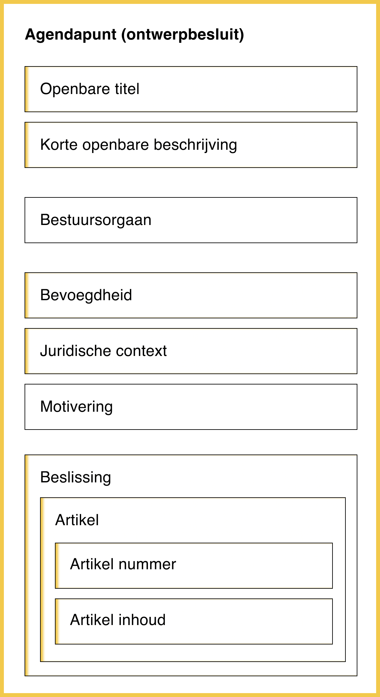

# Fase 1: Voorbereiden agendapunten

## Context

Een lokaal bestuur bereidt agendapunten – ook dossiers of ontwerpbesluiten genoemd – apart voor. Dat gebeurt door de bevoegde dienst(en) binnen dat lokaal bestuur. Het gebeurt ook dat medewerkers van de secretarie agendapunten die geen specifieke kennis vereisten voorbereiden, zoals de goedkeuring van de notulen van de vorige zitting.

.png>)

**\[Hulp nodig: kloppen de mensen die betrokken zijn?]**

### Bestuursorganen

De agendapunten worden voor verschillende bestuursorganen voorbereid. In de applicatie log je in als medewerker van een Gemeente, OCMW of Provincie. **\[Hulp nodig: district ook? missen er organen of eenheden?]**

* Gemeente
  * Gemeenteraad
  * College Burgemeester & Schepenen (CBS)
  * Burgemeester
  * Autonoom Gemeentebedrijf (AGB)
* OCMW
  * Bijzonder comité
  * Vast Bureau
* Provincie
  * Provincieraad
  * Deputatie
  * Autonoom Provinciebedrijf (APB)

## Inhoud agendapunt

| Onderdeel                                            | Informatie                                                                                                                                                                           | Gelinkte informatie | Wordt gepubliceerd in                |
| ---------------------------------------------------- | ------------------------------------------------------------------------------------------------------------------------------------------------------------------------------------ | ------------------- | ------------------------------------ |
| **Openbare titel (in agendapunt zelf)**              | Deze titel wordt gebruikt bij het publiceren van het de uittreksels, notulen en besluitenlijsten.                                                                                    | Ja                  | Uittreksels, notulen, besluitenlijst |
| **Korte openbare beschrijving (in agendapunt zelf)** | Kan meer informatie geven over het besluit. Niet elk bestuur doet dit, sommigen kopiëren de titel. Wordt gebruikt bij het publiceren van de uittreksels, notulen en besluitenlijsten | Ja                  | Uittreksels, notulen, besluitenlijst |
| **Bestuursorgaan**                                   | Over welk bestuursorgaan gaat dit?                                                                                                                                                   | Nee                 | Notulen                              |
| **Bevoegdheid**                                      | Via de citatenplugin geeft het bestuur de rechtsgrond in die bepaalt dat het orgaan bevoegd is.                                                                                      | Ja                  | Notulen, uittreksels                 |
| **Juridische context**                               | Via de citatenplugin geeft het bestuur de juridische contexten in die gerelateerd zijn.                                                                                              | Ja                  | Notulen, uittreksels                 |
| **Motivering**                                       | Het bestuur geeft de motiveringen in.                                                                                                                                                | Neen                | Notulen, uittreksels                 |
| **Beslissing**                                       | De beslissing bestaat uit een of meerdere artikel(s).                                                                                                                                | Ja                  | Notulen, uittreksels                 |
| **Artikels**                                         | Een artikel bestaat uit een artikelnummer en de inhoud.                                                                                                                              | Ja                  | Notulen, uittreksels                 |
| **Artikel nummer**                                   | Opeenvolgende cijfers.                                                                                                                                                               | Ja                  | Notulen, uittreksels                 |
| **Artikel inhoud**                                   | Inhoud.                                                                                                                                                                              | Ja                  | Notulen, uittreksels                 |

## **Hoe werkt het in GN?**

Bekijk hoe het werkt in Gelinkt Notuleren** \[Hulp nodig: aparte pagina aanmaken?]**



### Rollen

Het is belangrijk dat elke dienst en alle medewerkers van de secretarie hier de rol `Schrijver` hebben. Dit wordt ingesteld op het [Gebruikersbeheer](https://overheid.vlaanderen.be/ict/ict-diensten/gebruikersbeheer) (ACM-IDM), meestal door de IT dienst van het lokaal bestuur.

* `Lezer` kan alle agendapunten bekijken.
* `Schrijver` kan alle agendapunten bekijken en bewerken.

### **Locatie**

In Gelinkt Notuleren kunnen dossiers voorbereid worden in de tab **Agendapunten**. Het is ook mogelijk om rechtstreeks een zitting aan te maken en daar agendapunten toe te voegen – maar dat is minder flexibel.

Agendapunten die verdaagd werden kunnen gekopieerd worden, zodat ze niet opnieuw opgebouwd moeten worden.

### Status

Er zijn 3 statussen

* `Concept` \
  Het agendapunt is in voorbereiding, maar werd nog niet aan een zitting gekoppeld. Het agendapunt kan ten allen tijde aangepast worden.
* `Geagendeerd` \
  Het agendapunt werd in een voorbereiding van een zitting opgenomen. De agenda kan nog veranderen, en het agendapunt kan nog aangepast worden.
* `Gepubliceerd` \
  Het agendapunt werd gekoppeld aan een zitting, en deze werd gepubliceerd. Het agendapunt kan niet meer aangepast worden.

In deze fase is enkel `Concept` van toepassing.

### Sjablonen

Wanneer je start met een nieuw agendapunt, start je met een van de 2 generieke sjablonen aan: **besluiten** (met een stemming) en **vrije tekst**. Voorbeelden van agendapunten:

* Besluiten
  * Goedkeuren van notulen
  * Reglementen
  * Verordeningen
  * Mededelingen **\[Hulp nodig: of vrije tekst?]**
* Vrije tekst
  * Discussiepunten
  * Varia

#### Stijl

We bieden 2 stijlen aan voor besluiten:

* **Nieuwe stijl**: gebruikt rubrieken om **bevoegdheden**, **juridische context** en **motivering** te scheiden. Sommige besturen gebruiken nog extra rubrieken, maar wij maken hier geen verder onderscheid. 
* **Klassieke stijl**: gebruiken "_gelet op_" en "_overwegende dat_" om **juridische** **context** en **motivering** te scheiden.

