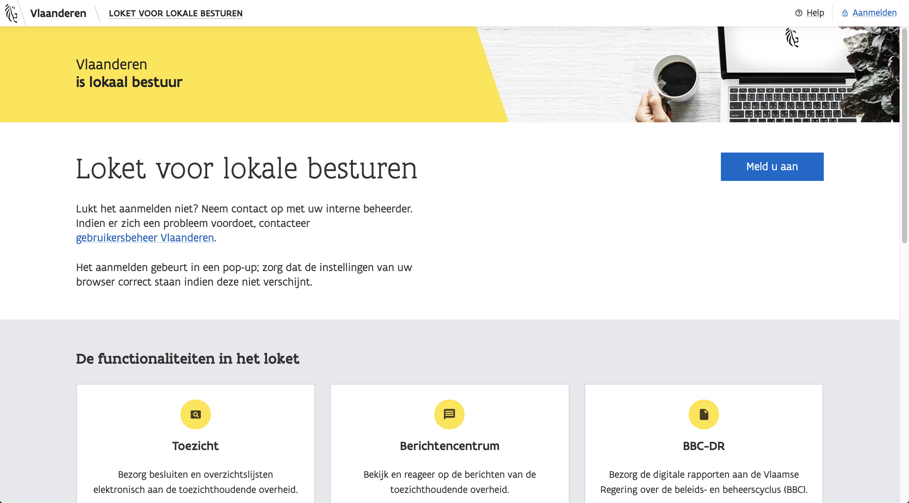
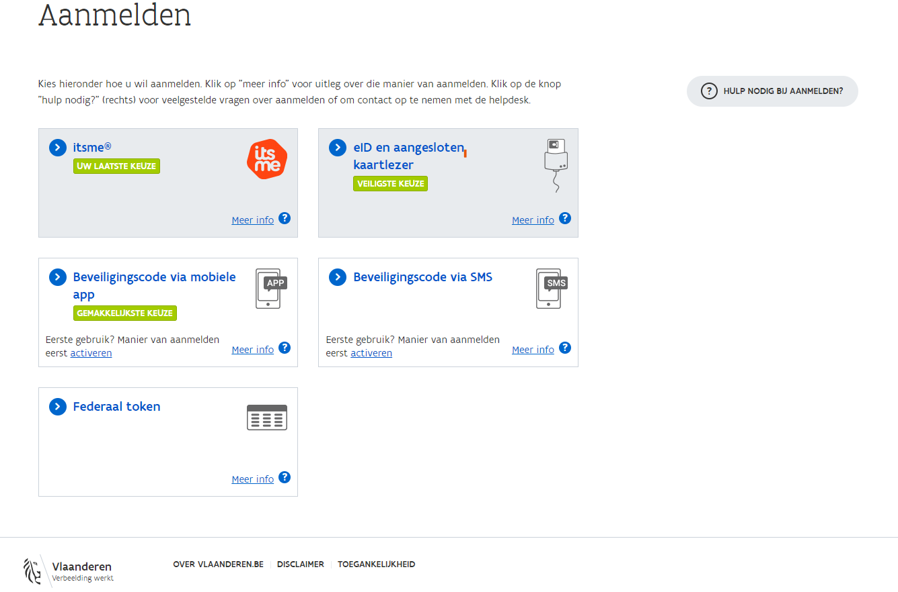
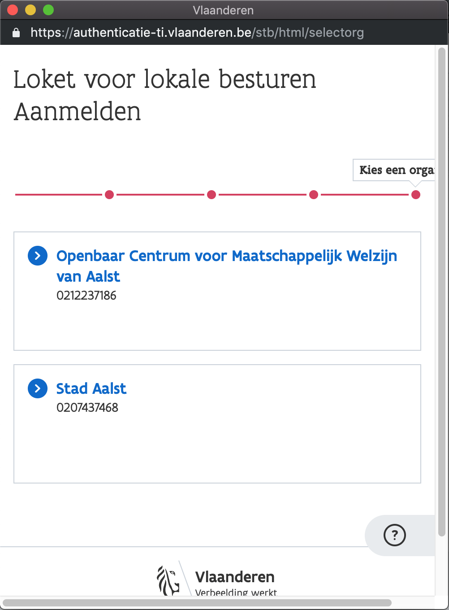
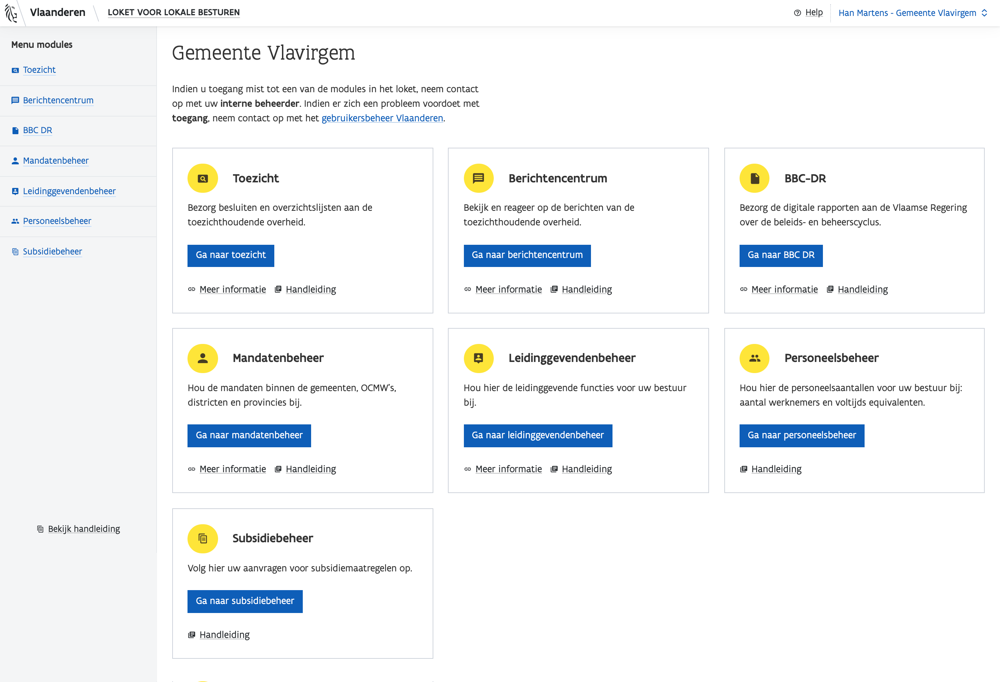

# Aanmelden

## Browser keuze: Firefox of Chrome

Om optimaal gebruik te maken van onze applicaties, gebruikt u best [**Firefox**](https://www.mozilla.org/nl/firefox/new/)** of **[**Chrome**](https://www.google.com/chrome/).


Het kan echter dat bepaalde functionaliteiten niet werken zoals het hoort. Mocht u dit opmerken, kunt u ons dit altijd laten weten via: [DigitaalABB@vlaanderen.be](mailto:DigitaalABB@vlaanderen.be).


## Aanmelden via de landingspagina

Aanmelden verloopt via het gekende gebruikersbeheer Vlaanderen.

Al onze applicaties hebben op hun landingspagina een blauwe knop met "**Meld u aan**" staan. Klik op deze knop om verder te gaan. [**Bekijk alle webapplicaties van het Agentschap Binnenlands Bestuur.**](../overzicht-code-repositories.md)****

## Pop-up

Vervolgens verschijnt er een pop-up, die u enkele veilige opties voorstelt om u mee aan te melden.

### Kiezen van een bestuurseenheid

Indien u toegang heeft tot meerdere bestuurseenheden, krijgt u in de pop-up de optie om een bestuurseenheid te kiezen.

### Krijgt u geen toegang?

Indien u een foutmelding krijgt, met de boodschap: "**U beschikt niet over de rechten om aant e melden op deze toepassing.**"

### Verschijnt de pop-up niet?

Zorg dat de instellingen van uw browser goed staan.

*   **Firefox**

    Bezoek deze link [https://support.mozilla.org/nl/kb/instellingen-pop-upblokkering-uitzonderingen-probleemoplossing](https://support.mozilla.org/nl/kb/instellingen-pop-upblokkering-uitzonderingen-probleemoplossing) en kies **Pop-upblokkeringsinstellingen**.
*   **Chrome**

    Bezoek deze link [https://support.google.com/chrome/answer/95472?co=GENIE.Platform%3DDesktop\&hl=nl](https://support.google.com/chrome/answer/95472?co=GENIE.Platform%3DDesktop\&hl=nl) en zoek naar **Pop-ups van een specifieke site blokkeren of toestaan**. Klik daarna op **Pop-ups van een bepaalde site toestaan**.


Krijgt u geen toegang tot de applicatie? Ga naar [Gebruikersbeheer](../toegankelijk-vlaanderen.md) voor meer informatie.


## Aangemeld

Na het kiezen van een bestuurseenheid, bent u ingelogd. U krijgt nu toegang tot de modules waar u voor gekend staat bij het [Gebruikersbeheer](toegang-verlenen-aan-gebruikers-tot-producten-en-diensten-via-gebruikersbeheer-vlaanderen.md).

