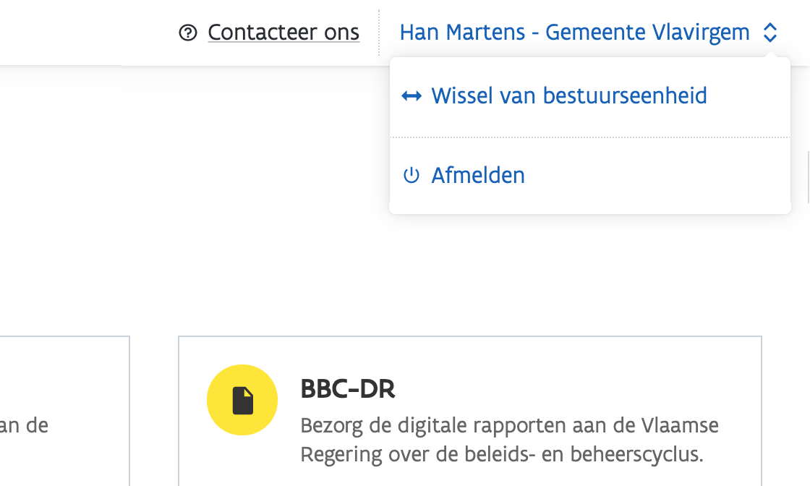
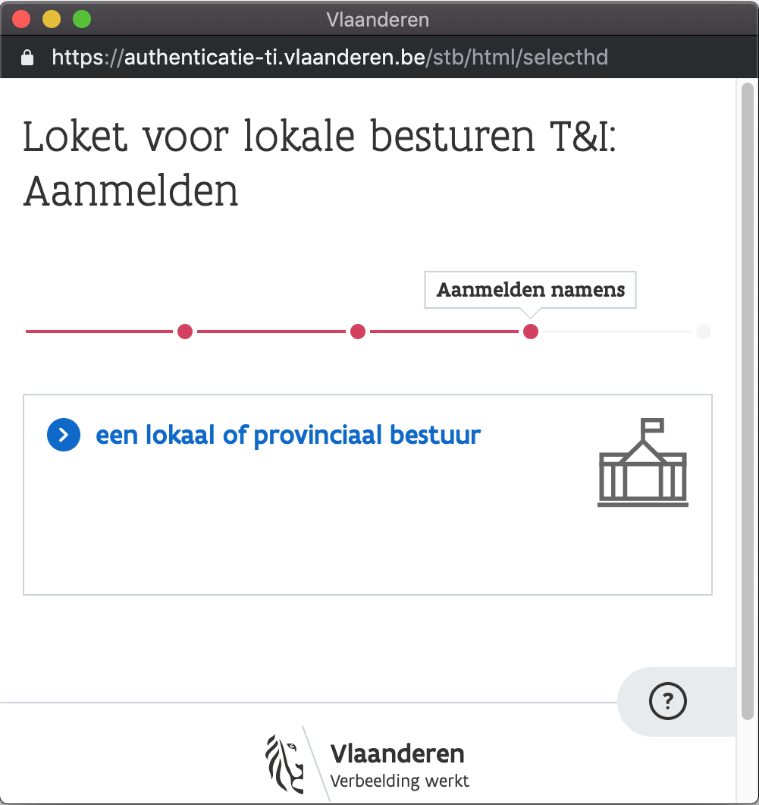
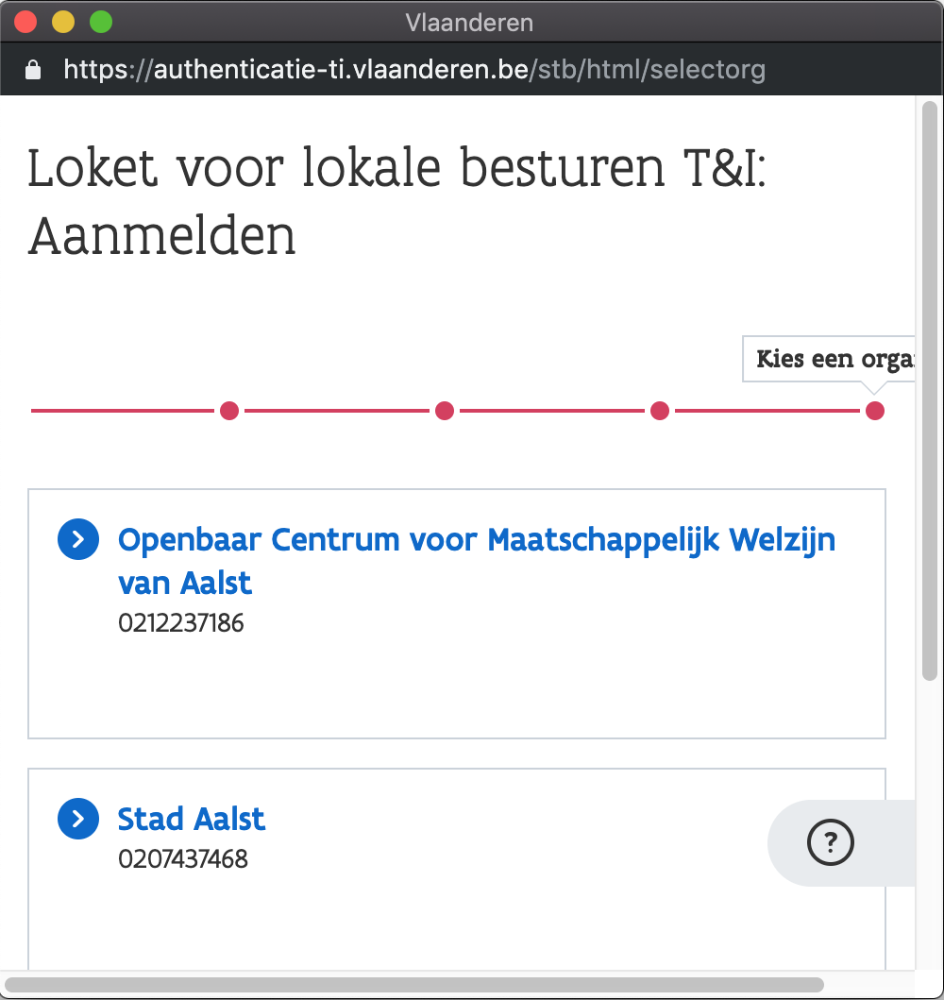

# Afmelden of wisselen van bestuurseenheid

## Knop - rechtsboven

Afmelden of _wisselen van bestuurseenheid_\* kan u door rechtsboven op uw bestuurseenheid te klikken.

\*_Wisselen van bestuurseenheid kan enkel voor specifieke applicaties, en enkel indien u toegang heeft tot meerdere bestuurseenheden._

## Wisselen van bestuurseenheid

Wanneer u klikt op "**Wissel van bestuurseenheid**" krijgt u opnieuw de pop-up te zien waar u eerst selecteert dat u zich wil aanmelden voor een lokaal of provinciaal bestuur. **Zorg ervoor dat uw browser deze pop-up ook toestaat.** [Bekijk hoe u popups toestaat](aanmelden.md#verschijnt-de-pop-up-niet).

Vervolgens kiest u de juiste bestuurseenheid.

