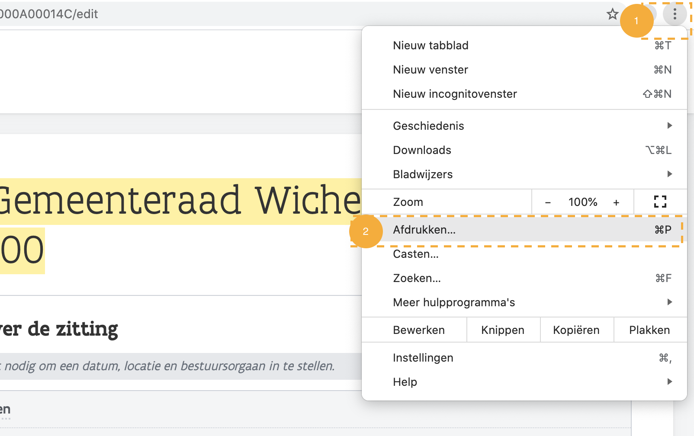
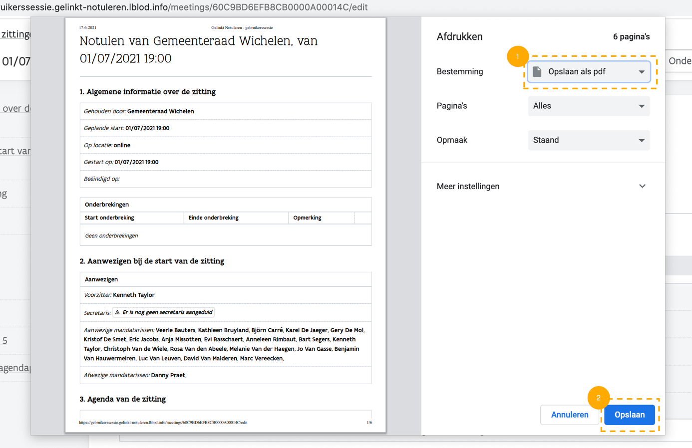

# Ondersteunende functie: Printen


Onze toepassing is geoptimaliseerd voor de browsers **Chrome** en **Firefox**. Wij raden dan ook aan een van deze browsers te gebruiken.


## Algemeen

U kan informatie op webapplicaties printen naar een fysieke printer en/of een .pdf document.

**Gebruik de printfunctionaliteit van uw browser.** Een voorbeeld van chrome:

1. Klik op de drie puntjes om de dropdown te zien verschijnen.
2. Kies afdrukken
3. Sla het document op als PDF of print het document.\
   _U kan ook bij "meer instellingen" de titels en de densiteit van het document aanpassen._

