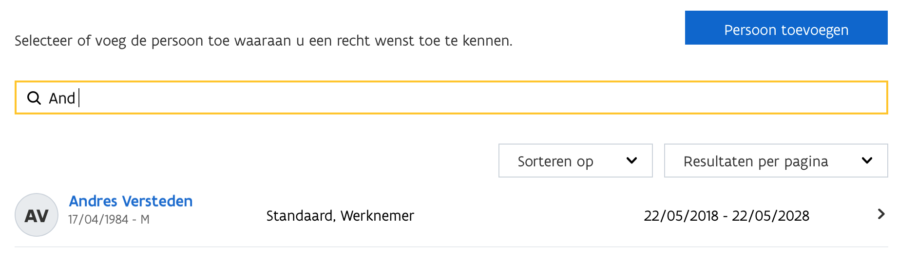

# Toegang verlenen aan gebruikers tot producten en diensten via Gebruikersbeheer Vlaanderen


**Om toegang te krijgen tot de meeste applicaties van ABB**, moet u de nodige toegangsrechten gekregen hebben via het gebruikers- en toegangsbeheer.


Toegangsrechten worden toegekend door de **lokale beheerder** die in elk bestuur aanwezig is. Meestal is dit de secretaris/algemeen directeur, griffier of iemand die door de organisatie werd aangeduid. U gaat dus best bij hen ten rade als u niet weet wie uw lokale beheerder is.

.png>)

## **Aanmelden en navigeren**

Om als lokale beheerder rechten toe te kennen aan gebruikers, surft u naar [**https://vo-gebruikersbeheer.vlaanderen.be**](https://vo-gebruikersbeheer.vlaanderen.be). Meer informatie op [https://overheid.vlaanderen.be/ict/ict-diensten/gebruikersbeheer](https://overheid.vlaanderen.be/ict/ict-diensten/gebruikersbeheer).

Meld u aan met uw favoriete aanmeldingssysteem:

Kies vervolgens **de juiste doelgroep**, en het bestuur waar u zich voor wil aanmelden.

Klik op **snel rechten toekennen** om te starten.

## Zoeken naar de juiste persoon

U krijgt een overzicht te zien, waar u kan zoeken naar de juiste persoon.

## Zoeken naar de juiste rechten

Vervolgens kan u voor de geselecteerde persoon de juiste rechten zoeken. Afhankelijk van de applicatie waar u voor kiest, is dat een ander recht.

### Overzicht rechten per applicatie

* Gelinkt Notuleren: **kies Gelinkt Notuleren**
* Loket Lokaal Bestuur: **kies Loket voor Lokale Besturen**
* Organisatieportaal: **kies ABB OrganisatiePortaal Gebruiker**

#### Voorbeeld "Gelinkt Notuleren".

.png>)

#### Voorbeeld zoeken naar "Loket voor Lokale Besturen"

## Rollen of contexten toekennen

Afhankelijk van de applicatie die u koos kan u nu [rollen](broken-reference) of [contexten](broken-reference) toekennen aan de persoon die u toegang verleende.

### Rollen toekennen

U kan een gebruikers het recht geven om bepaalde acties al dan niet uit te voeren op basis van rollen.

Een gebruiker kan rechten krijgen voor meerdere rollen.

#### Voorbeeld van 4 rollen voor Gelinkt Notuleren:

* Lezer;
* ondertekenaar (handtekenbevoegdheid);
* publiceerder;
* schrijver.

#### Voorbeeld van rollen voor Organisatieportaal:

* Beheerder
* Editeerder
* Lezer

### Contexten toekennen

U kan een gebruiker tot bepaalde onderdelen van de applicatie toegang verlenen of ontkennen aan de hand van contexten.

Eens een gebruiker toegang heeft tot een bepaalde context, kan deze gebruiker alle acties uitvoeren voor de bijbehorende onderdelen. Een gebruiker kan rechten krijgen voor meerdere contexten.

Voorbeeld van 7 contexten voor Loket Lokaal Bestuur:

* Context Gebruiker Mijn Toezicht: recht op onderdeel toezicht.
* Context Gebruiker Berichtencentrum: recht op onderdeel berichtencentrum.
* Context Gebruiker BBC DR: recht op onderdeel BBC-DR.
* Context Gebruiker Mandatenbeheer: recht op onderdeel mandatenbeheer.
* Context Gebruiker Leidinggevendenbeheer: recht op onderdeel leidinggevendenbeheer.
* Context Gebruiker Personeelsbeheer: recht op onderdeel personeelsbeheer.
* Context Gebruiker Subsidies: recht op onderdeel subsidiebeheer.

## Reden opgeven

Geef ook een reden op om het recht toe te kennen.

## Voltooien

U wordt gevraagd om het toekennen van rechten te bevestigen, waarna een boodschap verschijnt indien het proces met succes voltooid werd.

De persoon kan zich nu [aanmelden](aanmelden.md) met de toegekende rollen of contexten voor de gekozen applicatie.


Er is een vertraging van 5 à 10 minuten tussen het toekennen/afnemen van het recht en de effectieve toegang voor de gebruiker.

