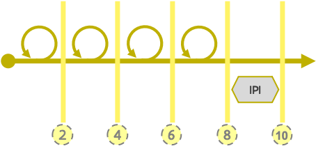

# Agile productontwikkeling bij ABB

De manier waarop we onze producten ontwikkelen en samenwerken is gebaseerd op de  [Scaled Agile Framework (SAFe)](https://www.scaledagileframework.com) maar aangepast om beter te werken met de ABB Digiteam manier om dingen te doen en het aantal mensen in ons team.


Deze pagina is nog in opbouw. Lees je iets raar? Vraag er even naar! [david.suijkerbuijk@vlaanderen.be](mailto:david.suijkerbuijk@vlaanderen.be)


## Agile ontwikkelen! Waarom?

Grote uitdagingen worden in kleine, concrete stappen ontwikkeld. Zo ontstaat er een constante flow en zien we het geheel groeien.

* Transparant overzicht houden op het werk 
* Werken in behapbare blokken
* Voldoende en flexibel plannen 
* Verantwoordelijkheden op de juiste plaats

## Vaste cadans op drie niveaus

* Rollende [roadmap](./#roadmap) die minstens één jaar vooruit kijkt. 
* [Groeispurts](./#groeispurt) van 10 weken eindigend met een [Centrale Planningsdag](./#centrale-planningsdag-cpd). 
* Iedere Spurt bestaat uit [vier sprints](./#development-sprint) en [één IPI](./#innovatie-en-planning-iteratie-ipi).


Het releasen van ontwikkelingen is niet per definitie gekoppeld aan de cadans.


### Roadmap


We gebruiken een vrij uitgebreide roadmap. Daarbij vinden we het belangrijk dat we concreet definiëren voor welke doelgroep de desbetreffende functionaliteit meerwaarde oplevert. Deze bijgewerkte roadmap op middellange termijn vind je in onze [online-tool](https://digiteamabb.airfocus.com/share/e10b08ccff8cb4548c5c5c7525caf368) die gelinkt is aan de JIRA-tool die het hele productteam gebruikt voor de planning en opvolging van de sprints & spurts in de scaled agile werking.

.png>)

Het opstellen en bijsturen van de roadmap is een continue gegeven: deze wordt elke groeispurt bijgestuurd in functie van de resultaten en ervaringen van de afgelopen groeispurt en eventuele bijkomende doelen of gewijzigde prioriteiten.

### Spurten en Sprinten?

#### Groeispurt

Een groeispurt heeft steeds een duur van 10 weken. Het omvat vier ontwikkelsprints en een Innovatie en Planning Iteratie. In de laatste week van de een groeispurt is er een Centrale Planningsdag (CPD) waar de doelen voor de volgende groeispurt wordt vastgelegd.

Door in periodes van 10 weken te werken is er voldoende focus om stappen te zetten maar niet te veel rigiditeit om met een steeds veranderende context om te gaan. Het geeft de ontwikkelteams een duidelijke focus voor 10 weken maar wel de mogelijkheid om met de volgende groeispurt in te spelen op (veranderde) prioriteiten uit de organisatie. 

#### (Ontwikkel) Sprint

Een sprint is een afgebakende periode van twee weken waarin een productteam aan de slag gaat om een duidelijk sprintdoel te bereiken. Sprints volgen elkaar steeds direct op en hebben een aantal vaste elementen/rituelen: 

* Sprint Planning
* Standup
* Sprint demo 
* Sprint Retrospective
* Backlog refinement

#### Innovatie en Planning Iteratie (IPI)

Naast het ontwikkelen van functionaliteiten is er ook nood aan andere activiteiten om een product(team) verder te laten groeien. Daarom zijn de laatste twee weken van een groeispurt steeds speciaal omdat het expliciet ruimte biedt voor ... 

* Innovatie en experimenten 
* Training 
* Planningsactiviteiten voor volgende groeispurt

Wanneer? De Innovatie en Planning (IPI) iteratie gebeurt steeds op het einde van een Spurt.

#### Stramien voor de invulling van de IPI bij Digiteam ABB

Om de activiteiten die typisch in de IPI plaatsvinden te kunnen organiseren werd een kalender opgemaakt waarin elk van de noodzakelijke activiteiten een plaats kreeg.  Bij het uitzetten van de activiteiten hebben we rekening gehouden met enkele voorkeuren van het team met betrekking tot vergaderdagen en hebben we geprobeerd de innovatie-activiteiten als één blok te groeperen om focusverschuiving tussen innovatie en planningsvergaderingen te voorkomen. Deze kalender wordt gebruikt om bij de betrokken teams placeholders in de agenda te zetten zodat de nodige tijd wordt gevrijwaard in elke IPI.

Voorbeeldactiviteiten: testen nieuwe technologieën, breder delen van nieuwe functionaliteiten, kennisoverdracht, scoping sessies & brainstormen, retrospectieves, manier van werken herbekijken, ...

Deze kalender ziet er momenteel zo uit: 

_**WEEK 1 IPI: FOCUS op sprintplanning IPI - Innovatie - Inspect and adapt**_

| Day/Part | Maandag                              | Dinsdag                                          | Woensdag                    | Donderdag                   | Vrijdag                                   |
| -------- | ------------------------------------ | ------------------------------------------------ | --------------------------- | --------------------------- | ----------------------------------------- |
| AM       | Sprintplanning IPI                   | [Innovation](innovation.md)                      | [Innovation](innovation.md) | [Innovation](innovation.md) | [Inspect and Adapt](inspect-and-adapt.md) |
| AM       | ([Retrospectieve](retrospective.md)) | [Capacity check](capacity-check.md) DEV + Design |                             |                             |                                           |
| PM       | [Innovation](innovation.md)          | [Innovation](innovation.md)                      | [Innovation](innovation.md) | [Innovation](innovation.md) | [Inspect and Adapt](inspect-and-adapt.md) |
| PM       | ([Retrospective](retrospective.md))  |                                                  |                             |                             |                                           |

_**WEEK 2 IPI: Focus op Groeispurtplanning - Retrospectieve en Sprintdemo IPI**_

| Dag/Deel | Maandag                             | Dinsdag                             | Woensdag                                              | Donderdag                           | Vrijdag                           |
| -------- | ----------------------------------- | ----------------------------------- | ----------------------------------------------------- | ----------------------------------- | --------------------------------- |
| AM       | [Impact Mapping](impact-mapping.md) | [Impact Mapping](impact-mapping.md) | [Story Mapping](story-mapping.md)                     | [CPD](./#centrale-planningsdag-cpd) | [Retrospective](retrospective.md) |
| AM       | [Story Mapping](story-mapping.md)   | [Story Mapping](story-mapping.md)   | [Impact Mapping](impact-mapping.md)                   |                                     |                                   |
| PM       | [Impact Mapping](impact-mapping.md) | [Impact Mapping](impact-mapping.md) | [Capacity Check](capacity-check.md) PM's ifv planning | [CPD](./#centrale-planningsdag-cpd) | Sprintdemo IPI                    |
| PM       | [Story Mapping](story-mapping.md)   | [Story Mapping](story-mapping.md)   |                                                       |                                     | Prepare backlog for sprint 1      |


De capaciteit van de IPI mag niet worden ingecalculeerd voor het halen van de Spurt-doelen. Het niet gewoon een 'extra' sprint.


### Centrale Planningsdag - CPD

De centrale planningsdag is een essentieel terugblikmoment om terug te kijken naar de Groeispurt die eindigt en te plannen voor de volgende Groeispurt. Daarom vindt deze plaats tussen twee groeispurten in.

Het geeft tijd aan alle actoren in onze agile productontwikkeling om  ...

* Delen van gerealiseerde oplossingen a.h.v. demo’s in een plenaire sessie.
* Plannen van de volgende Spurt o.b.v. de voorbereiding die vooraf gemaakt werd tijdens de IPI. Epics (productfunctionaliteiten) worden gepland om uit te voeren. Hun implementatie draagt uiteindelijk bij  tot [oplossingen](../levensloop-van-een-oplossing.md#oplossingen-hoe) waaraan ze gelinkt zijn.
*  Afstemming tussen verschillende producten om tot gedeelde oplossingen te komen

Wanneer? De Centrale Planningsdag (CPD) gebeurt steeds tijdens de IPI op laatste donderdag van een Spurt.
