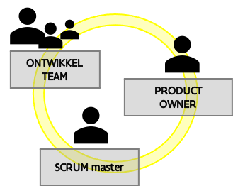

# Rollen


Deze pagina is nog in opbouw. Lees je iets raar? Vraag er even naar! [david.suijkerbuijk@vlaanderen.be](mailto:david.suijkerbuijk@vlaanderen.be)



Alle rollen binnen de SAFe-werking binnen het projectteam staan zo dicht mogelijk bij de eindklant(en). De focus verschilt wel afhankelijk van het stadium waar een oplossing zich in bevindt. Iedereen moet zijn/haar focus kunnen houden om zo goed en snel mogelijk oplossingen en dus waarde te kunnen leveren.


## Product teams

*

Een Product team bestaat uit een Product Owner, Scrum Master en ontwikkelteam. Op basis van Scrum worden door de product teams nieuwe functionaliteiten en oplossingen opgeleverd in de [ontwikkelcadans](de-ontwikkelcadans/). 

Product teams hebben alle benodigde vaardigheden  om elke Sprint waarde te creëren. Ze zijn dus **multidisciplinair**. Daarnaast is het Scrum Team **zelfsturend** en bepalen ze dus onderling wie wat opneemt.

### Product Owner

De Product Owner vertaalt de visie voor de klanten op het product naar functionele acties **met als doel** samen met inhoudelijke business experten en IT-technische collega’s te komen tot processen, diensten en toepassingen die beantwoorden aan de noden en zo waarde te leveren binnen de [waardestromen](levensloop-van-een-oplossing.md#waardestromen-waarom) van ABB. Dit gebeurt volgens de overeengekomen normen in termen van tijd, kwaliteit en kosten. 

* vormt een tandem met de [Product Manager](rollen.md#product-manager);
* vertaalt de visie op het product naar functionele acties om zo de doelstellingen te garanderen;
* stimuleert het team om kwaliteitsvolle stories te definiëren en de backlog te prioriteren;
* maximaliseert samen met het productteam de waarde die  gecreëerd wordt voor belanghebbenden;
* zorgt ervoor dat wat wordt opgeleverd voldoet aan de behoeften van de belanghebbenden;
* haalt waardevolle informatie op binnen en buiten de organisatie en bouwt daarvoor stabiele interne en externe netwerken op;
* past de technieken van agile product management en business analyse toe volgens de vooropgestelde kwaliteitsvereisten en procedures;

### Ontwikkelteam

Het ontwikkelteam is multidisciplinair en bestaat dus niet enkel uit ontwikkelaars, ook [designers](../analysis-design-and-communication/design/werken-als-designer-bij-abb.md), [analisten](../analysis-design-and-communication/analysis.md), [testers](../testing/testing.md) en architecten kunnen er deel van uitmaken. Deze zijn bij ABB vaak niet exclusief voor één product.

.png>)

## Product Manager

De Product Manager definieert op een strategisch niveau de visie voor de klanten op een product met als doel deze visie te vertalen naar een roadmap voor het product en oplossingen. Dit gebeurt in lijn met de overeengekomen normen in termen van tijd, kwaliteit en kosten.

* werkt nauw samen met een breed scala aan mensen om de behoeften van belanghebbenden te identificeren en de oplossingscontext te begrijpen;
* stimuleert en organiseert de samenwerking binnen het team zodat het product waarde creëert voor de belanghebbenden;
* ontwikkelt visie op het product, stelt een roadmap op en vertaalt deze in oplossingen waar het team verder aan werkt;
* toont aan hoe een oplossing een positief effect heeft op een [waardestroom](levensloop-van-een-oplossing.md#waardestromen-waarom) en dus waarde kan bieden voor interne en externe klanten;
* boort nieuwe domeinen aan waarvoor het product waarde kan leveren;
* identificeert en contacteert potentiële gebruikers en integratie-partners;
* werkt in tandem samen met de [Product Owner](rollen.md#product-owner) die de visie vertaalt naar concrete Epics en stories voor het [productteam](rollen.md#product-teams). 

## Communities of Practise (COP)

Om kennisdeling over en consistentie in, bijvoorbeeld, gebruikte technieken te stimuleren worden er door de [_Treinbegeleider_](rollen.md#treinbegeleider) periodiek _Communities of Practises_ georganiseerd. Een COP vind plaats rond een bepaalde rol in de werking of specifieke competenties. Tijdens deze bijeenkomsten worden voorbeelden gedeeld, nieuwe technieken aangeleerd of zelfs nieuwe praktijken ontwikkeld.

## Ondersteunde rollen op Solution-niveau

### Solution Delivery Manager

Bewaakt de effectieve waarderealisatie van uit oplossingen door

* potentieel van oplossingen te verduidelijken  o.b.v. input van andere stakeholders. Bijvoorbeeld door gebruik te maken van waardefiches, oplossingenfiches & impactmaps;
* stimuleren en ondersteunen van contact tussen projectteam en (eind)gebruikers;
* lanceren van oplossingen binnen en buiten ABB.

### Treinbegeleider

De treinbegeleider zorgt ervoor dat de nodige procesmatige en technische afstemming (tussen producten) gebeurt en jaagt dit zelfs aan. Hiervoor start die idealiter vanuit de [roadmap](de-ontwikkelcadans/#roadmap) en de [waardestromen](levensloop-van-een-oplossing.md#waardestromen-waarom).\
Daarnaast begeleidt de treinbegeleider het leren en continue verbeteren van de SAFe-werking. Dit zowel binnen het Project Team als ruimer in heel ABB.

* werkt nauw samen met de Product Owners en Product Managers om afstemming te stimuleren en begeleiden;
* zorgt dat de waardestromen en roadmap up-to-date en gekend zijn;
* organiseert en faciliteert belangrijke overlegmomenten (Centrale Planningsdag, Communities of Practises, Solution Stand-ups);
* organiseert periodieke retrospectieves en zorgt dat verbeteringen o.b.v. de inzichten tot stand komen;
* ondersteuning en eerste hulp bieden rond Agile werken van product- tot solution-niveau.

### Andere rollen op Solution-niveau

* De **manager Digitale Oplossingen** incorporeert oplossingen in Solution Roadmap. Coördineert informatie, middelen en capaciteit zodat oplossingen ontwikkeld kunnen worden.
* De **ICT architect** bepaalt de architecturale roadmap en technologiestrategie. Binnen dit kader bewaakt die de beste fit van oplossing met technologie.
* De** ICT directeur **brengt mogelijke waardevragen uit de organisatie in en bewaakt de strategische alineëring.

